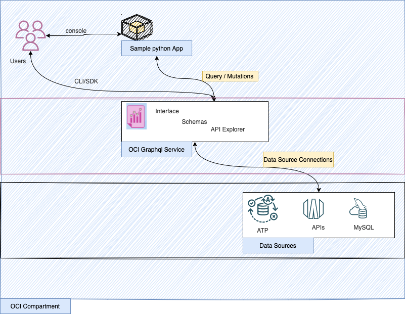

A sample python FAST API application with OCI Graphql .
----



Required softwares 

----

- Python 3.7 or above.

Data source requirements

---

- Oracle Autonomous Transaction processing data base .
- Using SQL create below tables (refer the scemas/ensure to enable the primary key(PK))

  - 1 - Table Name : ATEENDEES
```aidl
Name    Null?    Type
------- -------- ------------ 
FNAME   NOT NULL VARCHAR2(64)
LNAME   NOT NULL VARCHAR2(64)
MAILID  NOT NULL VARCHAR2(64) - PK 
PWD     NOT NULL VARCHAR2(64)
COUNTRY NOT NULL VARCHAR2(64)
```
- 2 - Table Name : SESSIONS
```aidl
Name         Null?    Type         
------------ -------- ------------ 
SNAME        NOT NULL VARCHAR2(64) 
SDESCRIPTION NOT NULL VARCHAR2(64) 
SDATE        NOT NULL VARCHAR2(64) 
SID          NOT NULL VARCHAR2(64) - PK 
SCATEGORY    NOT NULL VARCHAR2(64) 
```

- 3 - Table Name: ATEENDEES_SESSIONS

```aidl
Name         Null?    Type          
------------ -------- ------------- 
MAILID       NOT NULL VARCHAR2(64)  - PK 
SESSIONS_IDS NOT NULL VARCHAR2(300) 
```

OCI Graphql setup 

---


- Create an OCI Graphql endpoint.
- Create data source connection (using one of the available mode with ATP).
- Create Schema , promote and public.
- Using API explorer ,validate queries / mutations etc.


Usage

---

```aidl

- export export graphql_endpoint_url="OCI Graphql URL"
- git clone https://github.com/RahulMR42/oci-graphql-fastapi-app-sample-1
- cd oci-graphql-fastapi-app-sample-1
- pip install -r requirements.txt
- uvicorn app.main:app --reload --port 8080 --host 0.0.0.0
```


- Launch the application using http://"<IP or localhost >":8080
- Use the sidebar >Graphql Demo ,  to view the demo details 
- Use the new user option to register and followed by login.
- A seperate endpoint as http://"<IP or localhost >":8080/admin will be for admin operations.